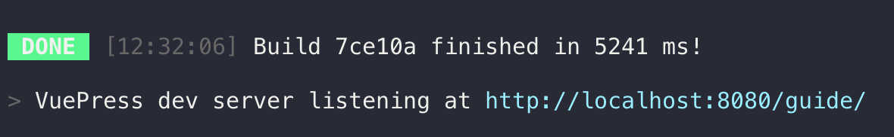

# Contribute

::: tip INFORMATION
This guide and its content are produced and reviewed by the community and anyone is free to contribute.
:::

**Join us on [Gitter](https://gitter.im/OMGnetwork/guide) to get started !**

## Suggestions / Reports

To report errors/inaccuracies or suggest enhancements, you may create a [Github issue](https://github.com/OMGnetwork/guide/issues/new), and please follow this set of recommandations :

* **Use a clear and descriptive title** for the issue to identify the suggestion/report.
* **Provide a thorough description of the suggested enhancement** or **justify the inaccuracy of the content** in as many details as possible.
* **Explain why this enhancement would be useful** to most users of the OMG Network Guide.

[Learn more about GitHub issues](https://guides.github.com/features/issues/)


## Your First Contribution

Unsure where to begin contributing to the OMG Network Guide? You can start by looking through these `good-first-issue` and `help-wanted` issues:

* [Good first issue](https://github.com/OMGnetwork/guide/issues?q=is%3Aopen+is%3Aissue+label%3A%22good+first+issue%22) - issues which should only require a minimal knowledge of the project.
* [Help wanted issues](https://github.com/OMGnetwork/guide/issues?q=is%3Aopen+is%3Aissue+label%3A%22help+wanted%22) - issues which should be a bit more involved than `good-first-issue` issues.

Still unsure where to begin? **[Let us help you !](https://gitter.im/OMGnetwork/guide)**


## Sending a contribution

Contribution is done through Github Pull Requests. This involves forking the original repository, and sending a pull request.

[Learn more about forking and pull requests on Github](https://guides.github.com/activities/forking/)


## Local edition

You may edit this guide locally, this will provide the benefit of seeing the changes you make _instantly_ in a browser, as if you were browsing the real website.

Follow these steps :

* Install [Yarn](https://yarnpkg.com/lang/en/docs/install)
* Install [Github Desktop](https://desktop.github.com/) (or any Git client)
* [Fork](https://guides.github.com/activities/forking/) the guide repo, and clone it
* Open a terminal (OSX, Linux) or a [Command Prompt](https://www.lifewire.com/how-to-open-command-prompt-2618089) on Windows
* Go to the repository's folder (`cd C:\Path\To\My\Repo`)
* Type the following :

```
yarn install
yarn dev
```

After a few minutes you should see the following :



Click the link, the "local" guide will pop up in a browser window. From now on, you may edit the source files, and see the result in that browser window.

Need help to install the repo locally ? [Poke us](https://gitter.im/OMGnetwork/guide)


## Contributors

<ContributorsList/>
